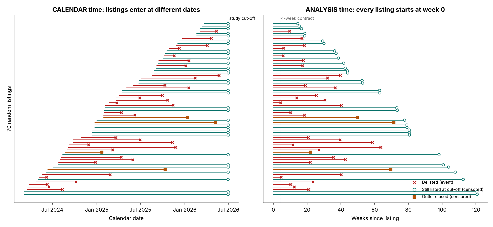
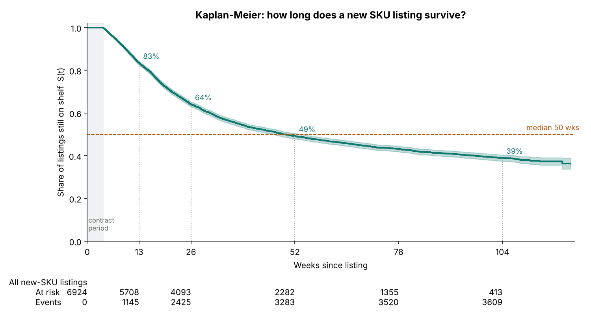
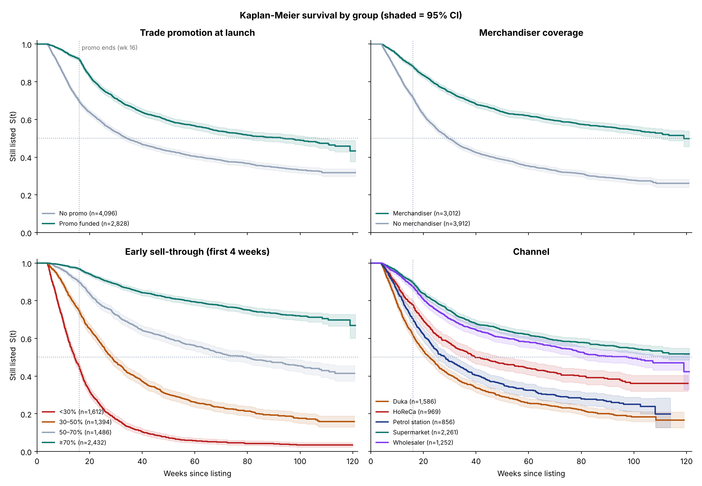
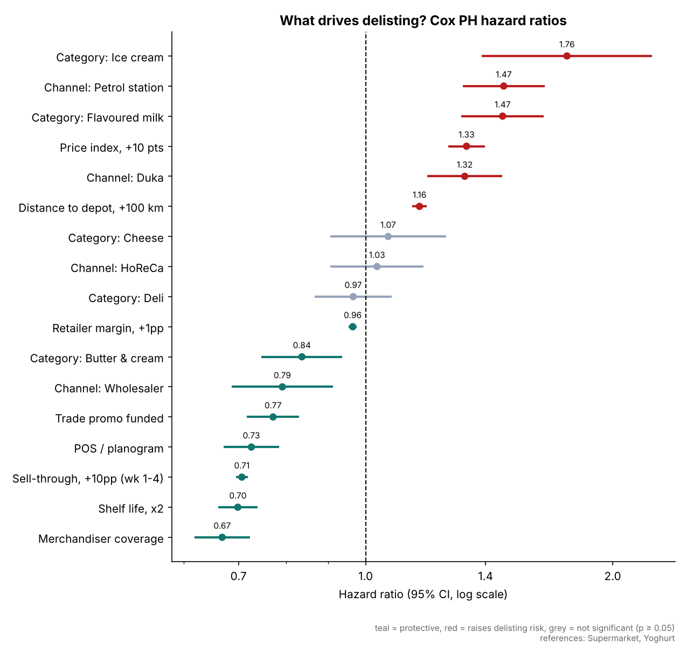
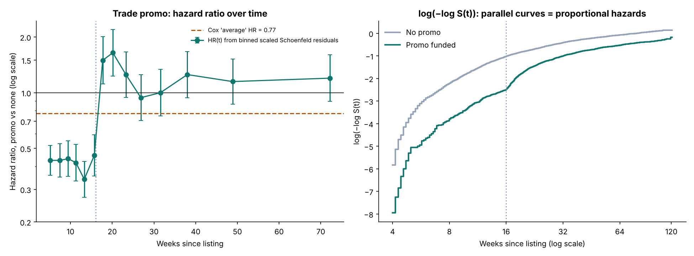
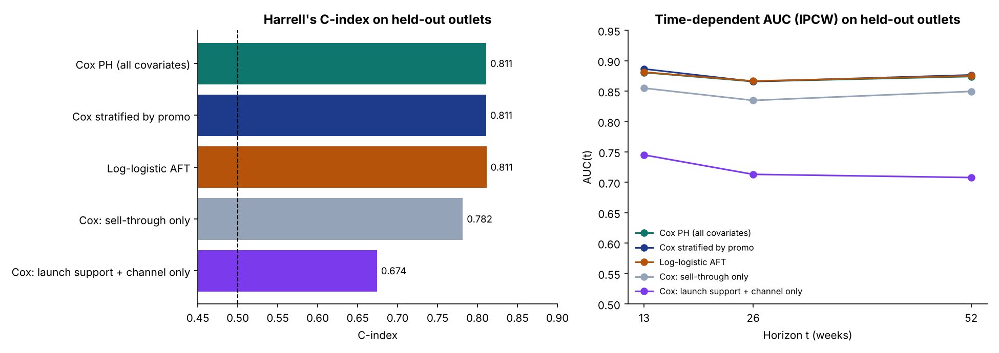
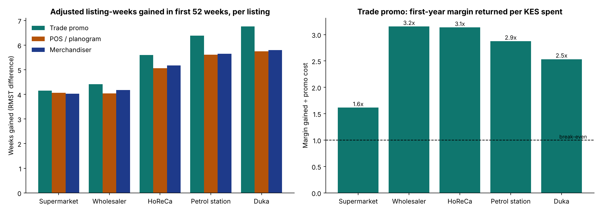

# New-SKU Listing Survival Analysis: how long do new products stay on the shelf, and what keeps them there?

A time-to-event analysis of **6,924 new-product listings** (15 SKU launches × 2,228 retail outlets) for an FMCG dairy & deli business in Kenya. The question: **after a new SKU is listed in an outlet, how long does it survive before the outlet delists it, and which levers (early sell-through, trade promotion, POS, merchandisers, price, margin, channel) change that?**

Built in **Python (lifelines)** and rebuilt independently in **R (`survival`)**. The two implementations agree on every Cox hazard ratio (max relative difference **1.1 × 10⁻⁷**), every time-split Cox hazard ratio (4.9 × 10⁻¹⁴), every Weibull time ratio (1.2 × 10⁻⁵), the AFT AICs, and the RMSTs.

> **Data note:** all data is **synthetic**, generated by [`data/generate_data.py`](data/generate_data.py): listings from March 2024 to May 2026 with a study cut-off of 30 June 2026. Hidden effects (including an unobserved "appeal" per SKU) drive the delisting hazard, and only observable columns are exported. No real company, outlet or sales data is used.

| | |
|---|---|
| 📓 **Full walkthrough, every step explained** | [`python/sku_listing_survival.ipynb`](python/sku_listing_survival.ipynb) |
| 📊 **R rebuild + cross-check report** | [`R/fmcg_survival.R`](R/fmcg_survival.R) → [`outputs/r/R_results.md`](outputs/r/R_results.md) |
| 🚨 **Ranked rescue list of live listings** | [`outputs/python/live_listing_risk_scores.csv`](outputs/python/live_listing_risk_scores.csv) |

---

## 1. Why survival analysis?

New SKUs are usually tracked as "% of outlets listed" or "% delisted" snapshots. With real launch data, those numbers mislead:

| Problem | What it does to naive numbers | How survival analysis handles it |
|---|---|---|
| **Staggered entry:** SKUs launch on different dates and roll out over weeks | Old launches have had more time to lose listings; new ones look better | Each listing gets its own clock, starting at week 0 = listing date |
| **Right-censoring:** 45% of listings are still on shelf at the cut-off | A logistic "delisted within 26 weeks?" model must drop or mislabel them | Censored listings contribute exactly the time they were observed |
| **Outlet closures** (2.8%) end listings for reasons unrelated to the product | Counting them as delistings inflates failure | Treated as censoring and checked for informativeness |
| **Effects that change over time** (a 16-week launch promo) | One "average" effect hides what happens when funding stops | PH diagnostics, time-varying coefficients, stratification |

In this data the naive "% delisted" per launch is correlated **−0.49** with launch order. The oldest launch looks the worst (87% delisted "so far") but by week 26 its delisting rate is 62%, in line with several later launches. Averaging "weeks on shelf" over delisted listings only gives 25 weeks. The actual median is about 50.



---

## 2. Method

```
6,924 outlet x SKU listings · event = delisted · censored = still listed at 30-Jun-2026 or outlet closed
   ├─► Data & censoring checks ·· reverse-KM follow-up · closure-censoring model · naive-vs-KM demonstration
   ├─► Non-parametric ··········· Kaplan-Meier (overall, by group, Greenwood log-log CIs, medians)
   │                              log-rank (2-group, k-sample, pairwise with Holm) · Nelson-Aalen + smoothed hazard
   ├─► Cox PH ··················· hazard ratios + forest plot · SKU-clustered robust SEs · worst-case closure sensitivity
   ├─► PH assumption ············ Schoenfeld tests (KM & rank transforms) · scaled-residual HR(t) · log(-log S)
   │                              FIX 1: time split at week 16 (counting process) · FIX 2: stratify on promo
   ├─► Parametric AFT ··········· Weibull vs log-normal vs log-logistic (AIC) · time ratios
   ├─► Prediction ··············· 75/25 split BY OUTLET · Harrell's C · IPCW time-dependent AUC & Brier at 13/26/52 wks
   ├─► RMST(52) ················· listing-weeks gained, with proper variance (matches R survfit)
   └─► Business translation ····· total-effect Cox (sell-through is a mediator) · g-computation of weeks gained
                                  · promo ROI by channel · week-4 triage rule · conditional 13-week risk for live listings
```

**Covariates:** 4-week sell-through, trade promo, POS / planogram, merchandiser, price index vs category, retailer margin, distance to depot, shelf life (log₂), channel (ref. Supermarket), category (ref. Yoghurt). A 4-week contractual minimum listing period means sell-through is always measured **before** any delisting can happen, so there is no immortal-time bias.

---

## 3. Results

### How long does a new listing survive?

| Weeks after listing | 13 | 26 | 52 | 78 | 104 |
|---|---:|---:|---:|---:|---:|
| **Still listed (KM)** | 83% | 64% | 49% | 43% | 39% |

* **Median time to delisting: 49.6 weeks** (95% CI 46.9–53.9)
* **RMST(52): 36.1 weeks.** In its first year an average new listing spends 36 of 52 weeks on the shelf.
* The risk is front-loaded: the hazard peaks around **week 11** (first range review), and listings that survive a year mostly stay.



### By group (Kaplan-Meier, unadjusted)

| Group | Median weeks | Still listed at wk 52 | RMST(52) weeks |
|---|---:|---:|---:|
| Sell-through ≥ 70% | not reached | 81% | 47.4 |
| Sell-through < 30% | **14** | **7%** | **18.6** |
| Supermarket | not reached | 64% | 41.8 |
| Wholesaler | 98 | 60% | 40.3 |
| HoReCa | 40 | 46% | 34.9 |
| Petrol station | 28 | 35% | 31.2 |
| Duka | 22 | 29% | 27.9 |
| Promo funded / not | 94 / 34 | 59% / 43% | 40.8 / 33.0 |

All differences are significant by log-rank test (all 10 pairwise channel comparisons after Holm correction). Early sell-through separates survival by far the most (χ² = 3,812 vs 785 for channel).



### What drives delisting? Cox proportional hazards (all listings, Efron ties)

| Driver | Hazard ratio (95% CI) | Plain English |
|---|---|---|
| Sell-through, +10pp in weeks 1–4 | **0.71** (0.70–0.72) | 29% lower weekly delisting rate per 10 points |
| Merchandiser coverage | **0.67** (0.62–0.72) | 33% lower |
| POS / planogram | **0.73** (0.67–0.78) | 27% lower |
| Trade promo (time-averaged; see PH below) | 0.77 (0.72–0.83) | misleading average |
| Price index, +10 points vs category | **1.33** (1.26–1.40) | 33% higher |
| Retailer margin, +1pp | 0.96 (0.95–0.98) | ~4% lower per point |
| Distance to depot, +100 km | 1.16 (1.14–1.19) | 16% higher |
| Shelf life, ×2 | 0.70 (0.66–0.74) | longer life protects |
| Petrol station / Duka vs Supermarket | 1.47 / 1.32 | faster delisting |
| Wholesaler vs Supermarket | 0.79 | slower |
| Ice cream / Flavoured milk vs Yoghurt (same shelf life) | 1.76 / 1.47 | freezer space and weaker products |

Concordance 0.81. With SKU-clustered robust SEs, the category terms' SEs inflate 2.2–2.5× (only 15 launches), while the outlet-level levers are barely affected. Treating every outlet closure as a delisting (worst case) moves no key HR by more than 0.03, except Duka (1.32 → 1.43).



### The PH assumption fails for trade promotion, and the fix tells the real story

The Schoenfeld test flags **trade promo** (χ² = 124, p < 10⁻⁴; R `cox.zph` χ² = 144). Nothing else fails at the 1% level. The time-varying hazard ratio shows why:

| Trade promo effect | Hazard ratio (95% CI) |
|---|---|
| Single "average" Cox HR | 0.77 (0.72–0.83) |
| **Weeks 0–16, while funding runs** | **0.32** (0.28–0.38) |
| **After week 16, funding stopped** | **1.17** (1.07–1.28) |

Splitting time at week 16 improves fit by χ² = 262 on 1 df. Stratifying on promo leaves no covariate failing PH (R global p = 0.11). **Promo funding is a strong but temporary shield.** Promo-funded listings hit a "cliff" right after the money stops (hazard peaks at week 19), and afterwards are slightly *more* likely to be delisted than comparable unfunded ones.



### Parametric models

| AFT model | AIC | ΔAIC |
|---|---:|---:|
| **Log-logistic** | **33,882.5** | 0 |
| Log-normal | 33,916.2 | 33.7 |
| Weibull | 34,014.9 | 132.4 |

The hump-shaped hazard favours the log-logistic. **Time ratios:** +10pp sell-through → listings last **28% longer**; merchandiser +31%; POS +23%; +10 price points → 15% shorter; petrol station 24% and duka 20% shorter than supermarkets. All three distributions under-predict the long-run plateau (39% still listed at week 104 vs about 30% predicted), which suggests a cure model as the next step.

### Prediction on held-out outlets (25% of outlets, never seen in training)

| Model | C-index | AUC wk 13 | AUC wk 26 | AUC wk 52 | Brier wk 52 |
|---|---:|---:|---:|---:|---:|
| Cox PH (all covariates) | 0.811 | 0.881 | 0.866 | 0.874 | 0.145 |
| **Cox stratified by promo** | **0.811** | **0.886** | 0.866 | **0.877** | **0.144** |
| Log-logistic AFT | 0.811 | 0.881 | 0.867 | 0.875 | 0.145 |
| Sell-through only | 0.782 | 0.855 | 0.835 | 0.850 | 0.158 |
| Launch support + channel only | 0.674 | 0.745 | 0.713 | 0.708 | 0.220 |
| No model (overall KM) | 0.500 | 0.500 | 0.500 | 0.500 | 0.253 |

**One number known at week 4, sell-through, gives most of the predictive power.** What is known before launch (support and channel) predicts much less.



---

## 4. Business translation

**Sell-through mediates launch support.** To value launch support we refit Cox **without** sell-through (the total effect, stratified by promo), then use **g-computation**: predict every listing with and without the lever and compare RMST(52).

| Channel | Listing-weeks gained in year 1: promo | POS | Merchandiser | Promo ROI* |
|---|---:|---:|---:|---:|
| Supermarket | 4.2 | 4.1 | 4.0 | 1.6× |
| Wholesaler | 4.4 | 4.0 | 4.2 | **3.2×** |
| HoReCa | 5.6 | 5.1 | 5.2 | **3.1×** |
| Petrol station | 6.4 | 5.6 | 5.7 | 2.9× |
| Duka | 6.8 | 5.8 | 5.8 | 2.5× |

\*First-year margin gained ÷ promo cost, on **illustrative** assumptions (margin per listing-week KES 450–5,000 and promo cost KES 1,200–9,000 by channel; see notebook section 13). Weeks gained are largest where baseline risk is highest (dukas). Returns are lowest in supermarkets, where listings mostly survive anyway and fees are highest.

Price matters more than the adjusted model suggests: the **total** HR per +10 price points is **1.78** (vs 1.33 holding sell-through fixed). Overpricing kills listings mainly by slowing early sales.



**Week-4 triage:** the 23% of listings with < 30% sell-through have a **79%** chance of being delisted by week 26. Listings above 70% have a 9% chance. Of the 3,109 listings live at the cut-off, the model expects **≈248 delistings in the next 13 weeks**, and **203 listings carry > 25% risk**: those make up the rescue list.

---

## 5. Recommended actions

| Finding | Action |
|---|---|
| Half of new listings are gone within ~50 weeks | Track launches with survival curves; review at weeks 13 / 26 / 52 against the benchmark |
| Week-4 sell-through predicts delisting best | **Week-4 listing review**: rescue plan for < 30% sell-through (merchandiser, shelf fix, price check, sampling) |
| Promo protects only while it runs (HR 0.32 → 1.17) | Treat promos as a bridge to sell-through: set week-12 targets, plan the post-promo handover, avoid funding cliffs before range reviews |
| Merchandisers / POS each add ~5 listing-weeks | Prioritise launch merchandising and POS in wholesalers and HoReCa (best weeks × margin) |
| Premium price hurts via early sales (total HR 1.78) | Launch near category price parity; take price after the listing is established |
| Remote outlets delist faster | Secure delivery reliability upcountry, or route new SKUs through wholesalers |
| ~200 live listings at > 25% quarterly risk | Work the ranked rescue list monthly |

---

## 6. Where survival analysis is used in business

| Domain | Event | Question |
|---|---|---|
| FMCG / retail | SKU delisting, outlet stops ordering | How long do listings last and what keeps them? |
| Customer analytics, telecoms, mobile money | Churn, dormancy | *When* will customers leave, and when to intervene? |
| Banking & micro-finance | Default, prepayment | Lifetime PD (IFRS 9), loan behaviour over time |
| Insurance | Policy lapse, claim | Lapse curves for pricing and reserving |
| HR analytics | Resignation | Attrition timing and drivers |
| Manufacturing | Equipment failure | Weibull reliability, maintenance, warranty |
| SaaS & subscriptions | Cancellation | Lifetime value via RMST |
| Healthcare & public health | Death, relapse, loss to follow-up | Clinical trials, TB / HIV treatment retention |

---

## 7. Limitations and next steps

- **Synthetic data:** effect sizes are illustrative; real data needs a careful operational definition of "delisted".
- **Observational:** support isn't randomised, so unobserved targeting may bias estimates. Run a **randomised launch-support trial**.
- **Clustering:** only 15 launches. SKU-level effects are imprecise (robust SEs reported); a **shared-frailty** Cox model is the next step.
- **Competing risks:** closure is treated as censoring (cause-specific hazard). A **Fine-Gray / cumulative incidence** view would quantify losses by cause (small here at 2.8%).
- **Plateau:** a **cure model** would estimate the share of listings that become permanent.
- **Dynamic scoring:** weekly sell-through, price and stock-outs as **time-varying covariates** in a counting-process Cox model.

---

## 8. Run it

```bash
pip install -r requirements.txt
python data/generate_data.py                                    # optional: regenerate data
python python/build_notebook.py
jupyter nbconvert --to notebook --execute --inplace python/sku_listing_survival.ipynb
Rscript R/fmcg_survival.R                                       # needs only the `survival` package; run after the notebook for the cross-check
```

```
fmcg-survival-analysis/
├── data/            generate_data.py · sku_listings.csv
├── python/          build_notebook.py · sku_listing_survival.ipynb (executed, all outputs embedded)
├── R/               fmcg_survival.R (survfit · survdiff · coxph · cox.zph · survSplit · survreg + cross-check)
└── outputs/         python/ (12 charts, HRs, PH tests, AFT, metrics, RMST, launch-support value, live risk scores)
                     r/ (3 charts, R_results.md, cox_hazard_ratios_R.csv)
```

**Stack:** Python · lifelines · pandas · NumPy · matplotlib · R (survival, base graphics)
