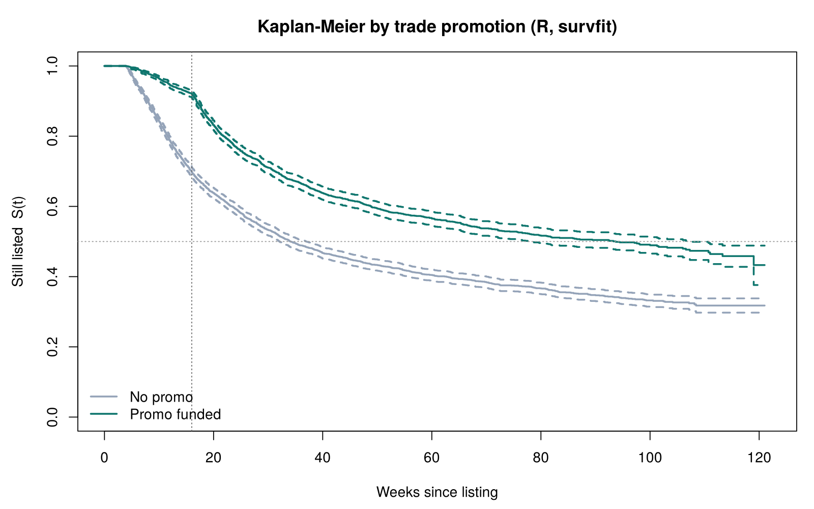
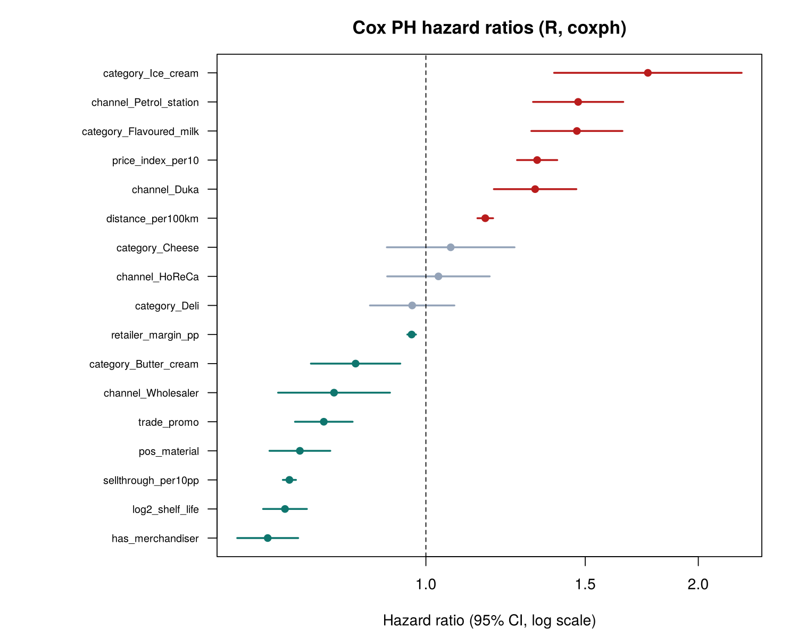
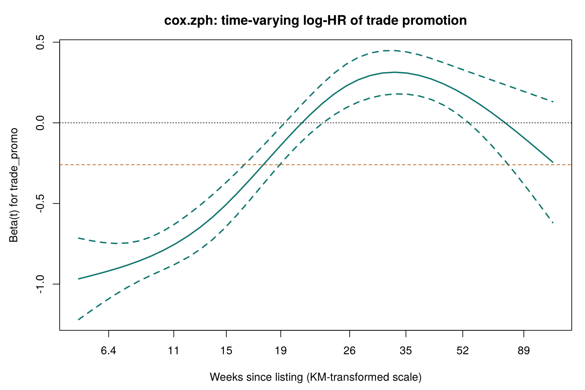

# New-SKU listing survival — R results (auto-generated by `R/fmcg_survival.R`)

*6924 outlet x SKU listings · 3620 delistings · 3304 censored (3109 still listed at cut-off, 195 outlet closed) · R `survival` 3.5.8*

## Cross-check with the Python notebook (lifelines)

- Cox PH hazard ratios: 17 compared, max relative difference **1.1e-07**
- Time-split Cox hazard ratios (counting process): 18 compared, max relative difference **4.9e-14**
- Weibull AFT time ratios: 17 compared, max relative difference **1.2e-05**
- AFT AIC (Weibull / log-normal / log-logistic): max absolute difference **0.0052**
- RMST(52) promo vs no promo: R 40.76 vs 32.96 weeks | Python 40.76 vs 32.96 weeks
- PH test for trade_promo: R cox.zph chi2 = 143.5 (p = 4.5e-33) | lifelines chi2 = 124.2. Both flag it; the statistics differ because survival >= 3.0 uses an exact score test and lifelines an approximation

Both implementations use Efron's method for tied event times (`coxph(..., ties = "efron")`; lifelines' default). With Breslow ties the R hazard ratios would differ slightly, because weekly-recorded durations contain many ties.

## Kaplan-Meier (survfit)

- Median time to delisting: **49.6 weeks** (95% CI 46.9–53.9)
- RMST(52): **36.14 weeks** (SE 0.22)

| week | still_listed | ci | at_risk |
| --- | --- | --- | --- |
|  13 | 0.834 | 0.825 – 0.842 | 5723 |
|  26 | 0.641 | 0.629 – 0.652 | 4106 |
|  52 | 0.492 | 0.479 – 0.504 | 2307 |
| 104 | 0.390 | 0.375 – 0.405 |  417 |

| group | median_wks | rmst_52 | se |
| --- | --- | --- | --- |
| No promo | 34.1 | 32.96 | 0.30 |
| Promo funded | 93.7 | 40.76 | 0.30 |

## Log-rank tests (survdiff)

| variable | chi2 | df | p_value |
| --- | --- | --- | --- |
| trade_promo | 247.4 | 1 | 9.7e-56 |
| pos_material | 424.1 | 1 | 3.2e-94 |
| has_merchandiser | 519.6 | 1 | 5.1e-115 |
| channel | 785.3 | 4 | 1.2e-168 |
| category | 608.6 | 5 | 2.8e-129 |

## Cox PH (coxph, Efron ties)

Concordance 0.808 · log partial likelihood -27943.6

| feature | HR | 95% CI | p_value |
| --- | --- | --- | --- |
| has_merchandiser | 0.669 | 0.62 – 0.72 | 2.6e-24 |
| log2_shelf_life | 0.699 | 0.66 – 0.74 | 1.9e-36 |
| sellthrough_per10pp | 0.707 | 0.69 – 0.72 |   0 |
| pos_material | 0.726 | 0.67 – 0.78 | 4.6e-16 |
| trade_promo | 0.771 | 0.72 – 0.83 | 3.7e-12 |
| channel_Wholesaler | 0.792 | 0.69 – 0.91 | 0.0013 |
| category_Butter_cream | 0.836 | 0.75 – 0.94 | 0.0021 |
| retailer_margin_pp | 0.964 | 0.95 – 0.98 | 9.4e-11 |
| category_Deli | 0.966 | 0.87 – 1.08 | 0.52 |
| channel_HoReCa | 1.032 | 0.91 – 1.18 | 0.63 |
| category_Cheese | 1.065 | 0.91 – 1.25 | 0.45 |
| distance_per100km | 1.163 | 1.14 – 1.19 | 6.1e-50 |
| channel_Duka | 1.320 | 1.19 – 1.47 | 2.1e-07 |
| price_index_per10 | 1.327 | 1.26 – 1.40 | 2.1e-27 |
| category_Flavoured_milk | 1.468 | 1.31 – 1.65 | 8.1e-11 |
| channel_Petrol_station | 1.473 | 1.31 – 1.65 | 3.7e-11 |
| category_Ice_cream | 1.759 | 1.39 – 2.23 | 3.5e-06 |

## Proportional hazards (cox.zph, KM transform)

| term | chi2 | p_value |
| --- | --- | --- |
| sellthrough_per10pp | 12.7 | 0.00037 |
| trade_promo | 143.5 | 4.5e-33 |
| pos_material | 0.4 | 0.55 |
| has_merchandiser | 0.0 | 0.85 |
| price_index_per10 | 0.0 | 0.89 |
| retailer_margin_pp | 1.1 | 0.29 |
| distance_per100km | 0.0 | 0.98 |
| log2_shelf_life | 2.0 | 0.16 |
| channel_Wholesaler | 0.8 | 0.36 |
| channel_Duka | 4.8 | 0.028 |
| channel_HoReCa | 2.4 | 0.12 |
| channel_Petrol_station | 1.6 | 0.2 |
| category_Cheese | 1.7 | 0.19 |
| category_Ice_cream | 5.5 | 0.019 |
| category_Deli | 0.1 | 0.79 |
| category_Butter_cream | 4.5 | 0.033 |
| category_Flavoured_milk | 1.0 | 0.31 |
| GLOBAL | 163.9 | 4.4e-26 |

**Fix 1 — time split at week 16 (survSplit, counting process):** likelihood-ratio chi2 vs single promo term = 262.4 on 1 df.

| feature | HR | 95% CI | p_value |
| --- | --- | --- | --- |
| sellthrough_per10pp | 0.707 | 0.70 – 0.72 |   0 |
| pos_material | 0.726 | 0.67 – 0.79 | 6.5e-16 |
| has_merchandiser | 0.672 | 0.62 – 0.73 | 1e-23 |
| promo_wk0_16 | 0.324 | 0.28 – 0.37 | 6.7e-53 |
| promo_after_16 | 1.173 | 1.07 – 1.28 | 0.00039 |

**Fix 2 — strata(trade_promo):** remaining terms with PH p < 0.01: none (global test p = 0.11).

## Parametric AFT models (survreg)

| model | AIC | log_likelihood | delta_AIC |
| --- | --- | --- | --- |
| Weibull | 34014.9 | -16988.4 | 132.4 |
| Log-normal | 33916.2 | -16939.1 | 33.7 |
| Log-logistic | 33882.5 | -16922.2 | 0.0 |

Weibull shape (1/scale) = 1.424. Selected Weibull time ratios (>1 = listing lasts longer):

| feature | time_ratio |
| --- | --- |
| has_merchandiser | 1.358 |
| log2_shelf_life | 1.334 |
| sellthrough_per10pp | 1.301 |
| pos_material | 1.267 |
| channel_Wholesaler | 1.164 |
| trade_promo | 1.143 |
| category_Butter_cream | 1.100 |
| retailer_margin_pp | 1.026 |
| category_Deli | 1.016 |
| channel_HoReCa | 0.939 |
| distance_per100km | 0.897 |
| category_Cheese | 0.879 |
| price_index_per10 | 0.820 |
| channel_Duka | 0.799 |
| category_Flavoured_milk | 0.755 |
| channel_Petrol_station | 0.727 |
| category_Ice_cream | 0.597 |
